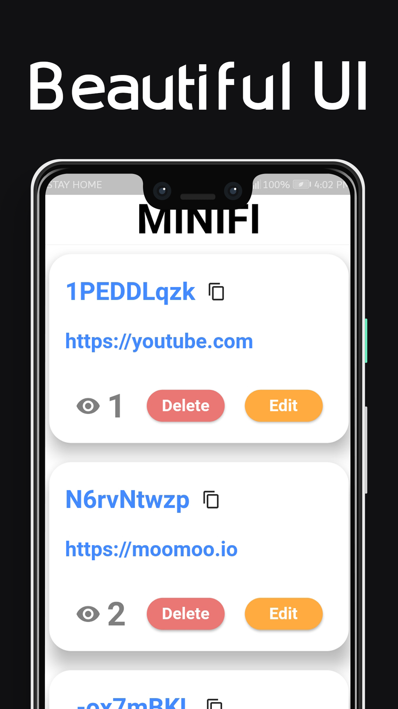
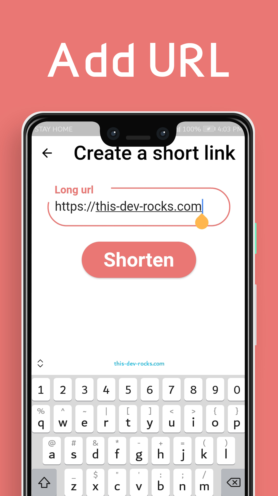
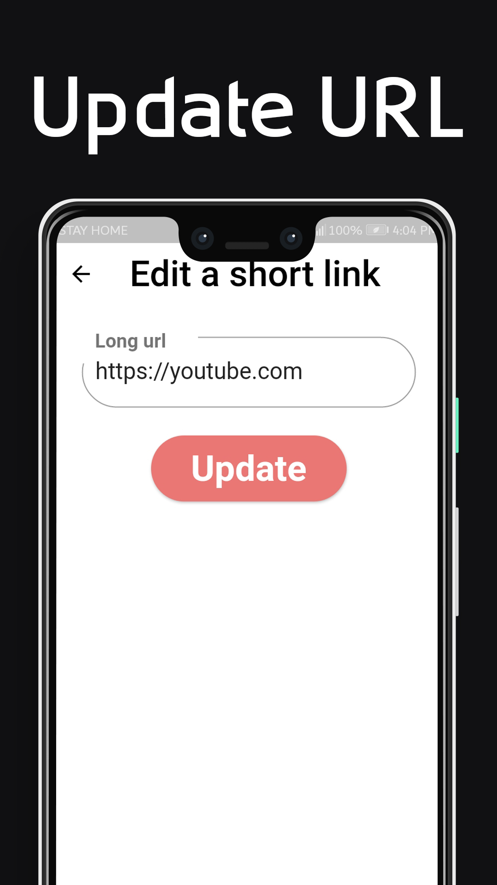
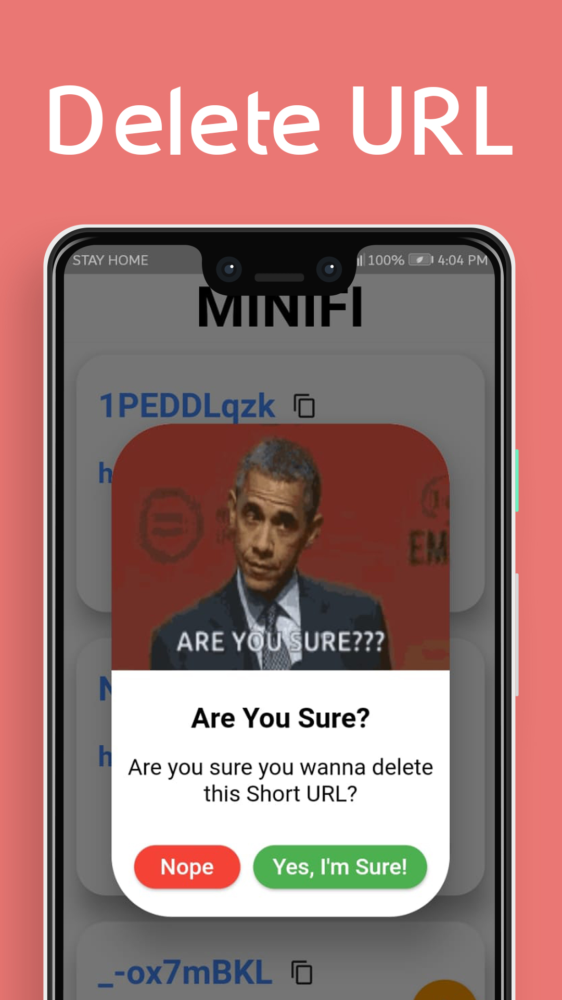

![license_badge]
![verion_badge]
![downloads_badge]
![stars_badge]
![forks_badge]
![issues_badge]

#

# Minifi App

Minifi App is an app that I made using [Flutter](https://flutter.dev/) framework!

# Information

This project is a [Flutter](https://flutter.dev/) app that I made to utilize the Minifi API that I made also, [check it out!](https://github.com/YazeedAlKhalaf/Minifi)

## Features

- [x] Basic CRUD operations!
- [x] Beautiful UI!
- [x] Launch URLs!

## Requirements

- [x] Flutter

## Platforms

- Android
- iOS (maybe soon)

### Android

If you have some problems with Google Play, here are the latest apks:

- [For all architectures (recommended)](https://github.com/YazeedAlKhalaf/Minifi_App/releases/download/v1.0.0/minifi-release.apk)
- [arm64-v8a](https://github.com/YazeedAlKhalaf/Minifi_App/releases/download/v1.0.0/minifi-arm64-v8a-release.apk)
- [armeabi-v7a](https://github.com/YazeedAlKhalaf/Minifi_App/releases/download/v1.0.0/minifi-armeabi-v7a-release.apk)
- [x86_64](https://github.com/YazeedAlKhalaf/Minifi_App/releases/download/v1.0.0/minifi-x86_64-release.apk)

### iOS

I don't have the binaries, but you can build it for yourself!

## How to use :thinking:

1. You must have Flutter installed and working on your development machine.
2. Install all packages by running `flutter pub get` in the project's directory to get all required packages.
3. Run your app with `flutter run`!

## Screenshots

# Wanna Contribute?

Feel free to contribute by opening an Issue or by creating a Pull Request!

# License

This project is licensed under a MIT license so show some :heart: and :star: the repo!

[license_badge]: https://img.shields.io/github/license/YazeedAlKhalaf/Minifi_App?style=for-the-badge
[downloads_badge]: https://img.shields.io/github/downloads/YazeedAlKhalaf/Minifi_App/total?style=for-the-badge
[verion_badge]: https://img.shields.io/github/v/release/YazeedAlKhalaf/Minifi_App?style=for-the-badge
[stars_badge]: https://img.shields.io/github/stars/YazeedAlKhalaf/Minifi_App?style=for-the-badge
[issues_badge]: https://img.shields.io/github/issues/YazeedAlKhalaf/Minifi_App?style=for-the-badge
[forks_badge]: https://img.shields.io/github/forks/YazeedAlKhalaf/Minifi_App?style=for-the-badge
